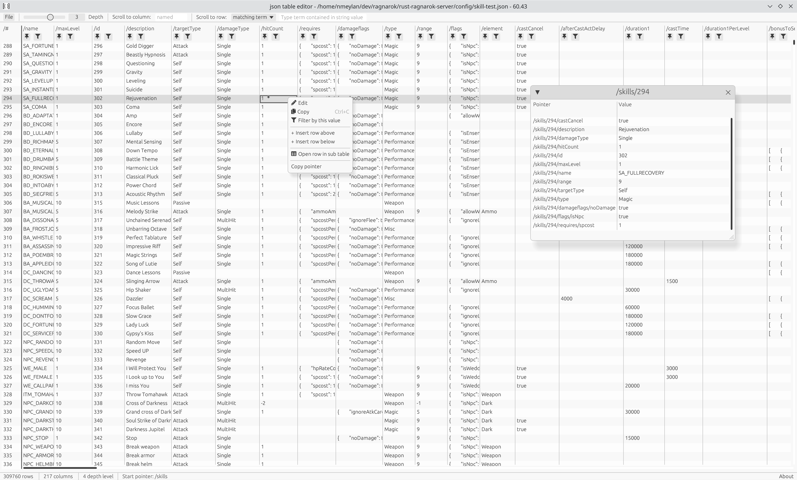

# Important
**Memory usage**: While this tool allow to edit large json file smoothly, it consumes a lot of memory due to technical decision which tradeoff memory in favor of better performance for navigation, edition and serialization.

[Web demo](https://nmeylan.github.io/json-table-editor/web/) 

# Features
## Implemented
- *lag-free* visualisation of large json array: only visible rows and columns are rendered
- Select column to render
- Filter out rows with null value at given columns
- Scroll to column
- Pin columns to left
- Open nested array in sub-table
- Open nested Object in sub-table
- Select depth for nested object
- Edit cell
- Filter columns by values
- Go to row number
- Search for matching terms

Json in video below is 372mb with an array of 309_759 entries, containing nested objects, it runs at ~60fps

https://github.com/nmeylan/json-table-editor/assets/1909074/6a4f932d-031c-4611-9627-2e2787da5401

## Performance and Memory usage
This editor use a custom json parser to deserialize json into a flat data structure allowing `O(n)` data access where `n` is number of fields of an array element, containing `k` elements. In general `n` not bigger than 200 but `k` can easily be >100000. 
While it is not the fastest parser on the market, it is still faster to use our custom parser instead of parsing using serde or other library generating tree data structure and then convert it to flat data structure. 

As this structure is flat, it also allows to parse only a subset of json files by defining a depth limit, the json files is still fully read but after a given depth, 
content is not deserialize we only keep raw content as String which then can be parse later, by changing depth.

This mecanism allow fast parsing of big json files, but consume more memory as for each depth level we store the full string and the parsed content.
Additionally, this mecanism allow to serialize only row that have been changed, unchanged rows are already serialized, speeding up edition of big files.

## Todo
- Add new column
- Add new row
